# sonar 使用说明

## 1.首先安装jdk

- 安装
  - software > jdk-8u171-windows-x64.exe
  - 下一步下一步即可
  - 如果修改了安装路径 ，需要自己记录一下。

-  环境变量配置
   - 网上一堆教程
   - [参考教程](https://zhuanlan.zhihu.com/p/106217147);


## 2.安装 sonarqube-7.1
> [sonar 官方网站](https://www.sonarqube.org/downloads/)

### 2.1前置条件

- jdk环境需要**jdk8**

- 解压到任意目录 【sonarqube-7.1.zip】（建议，非中文目录）

- 解压后的目录讲解

software | version  
------ | -------- 
bin | 此目录放置各操作系统（LInux、Windows、MacOS）用于启动 SonarQube 服务的工具、脚本；
bin > conf |  此目录存放SonarQube相关配置文件；
data|  此目录包含嵌入式数据库(H2数据库引擎)的数据，建议只用于测试和演示；
elasticsearch |  此目录放置elasticsearch检索引擎相关内容；
extensions | 此目录存放SonarQube的插件、 扩展jar 包；
lib  | 此目录存放SonarQube所依赖的 jar 包；
logs | 此目录存放SonarQube相关日志信息；
tmp  | 此目录包含服务器所需的临时数据，服务器启动时不要清理；
web  | 此目录存放 SonarQube web 服务的静态资源。


### 2.2启动

- 进入sonarqube目录
  - **sonarqube-7.1\bin\windows-x86-64**
  ```
  // 运行  
  startsonar.bat 
  
  ```
  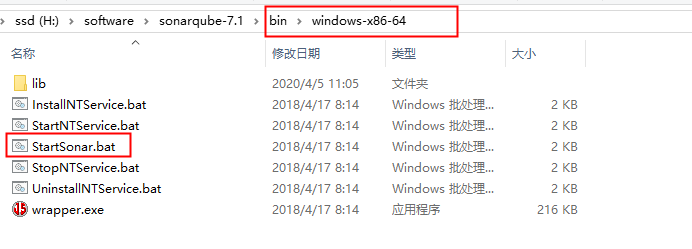
  
  - 等待cmd面板启动完毕后 打开浏览器输入 **localhost:9000** 测试是否启动成功
  
  - **sonar-cmd面板**
  
  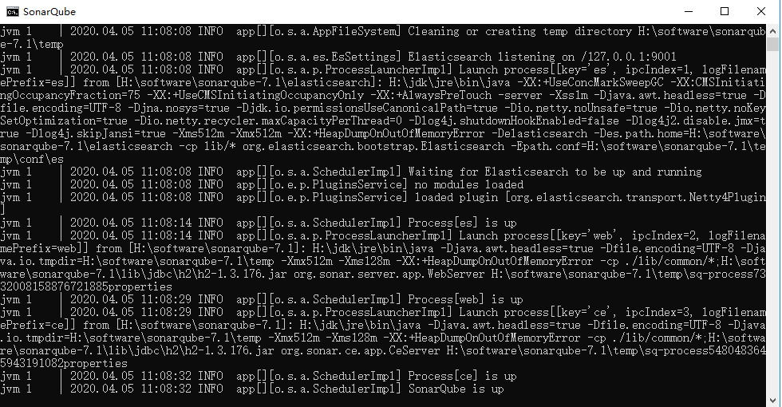
  
  - **sonar-page**
  
  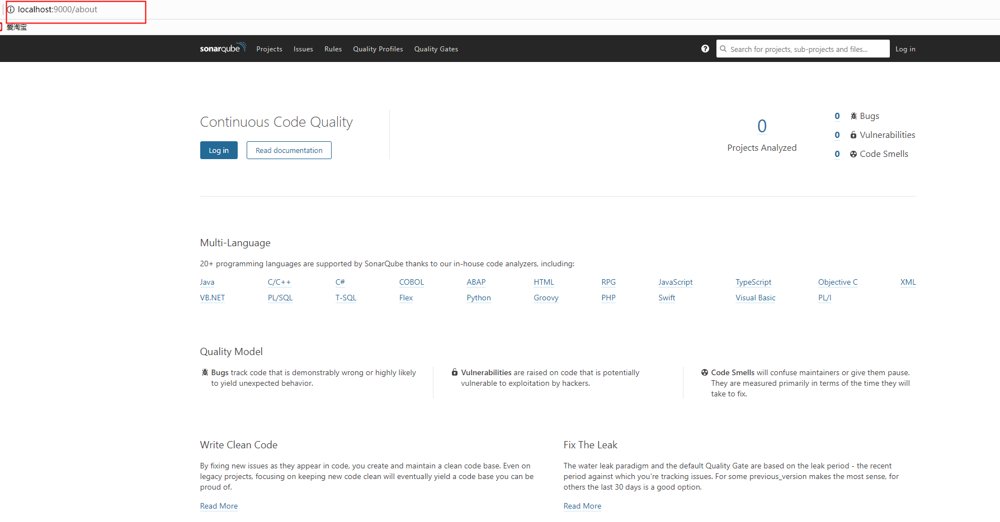
  
### 2.3关闭服务

打开任务管理器，找到java进程，然后结束即可！
- 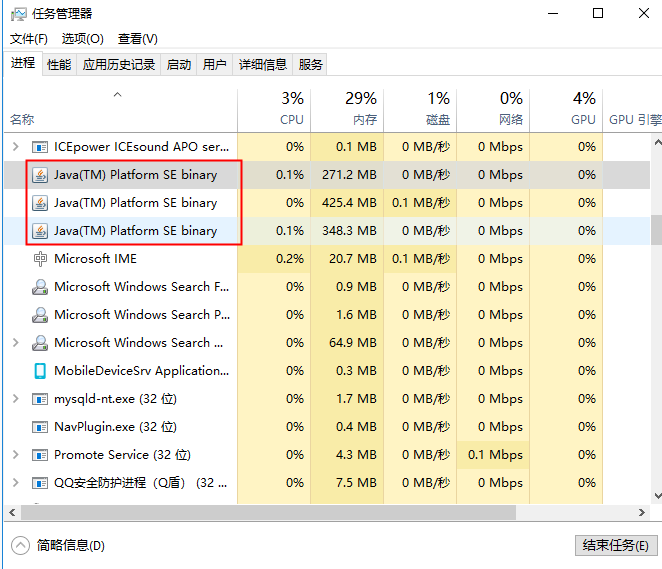

 
  
### 2.4汉化  
  
1. 先登录  
```
Account:  admin
Password: admin

// 密码可以在conf/sonar.properties 中修改
```
> 登录之后跳过


2. 搜索  **chinese pack**
-  一级导航选中 **Administration**
-  二级hi导航选中 **Marketplace**   
-  plugins  搜索框输入  **chinese pack**   
- 操作流程图
- 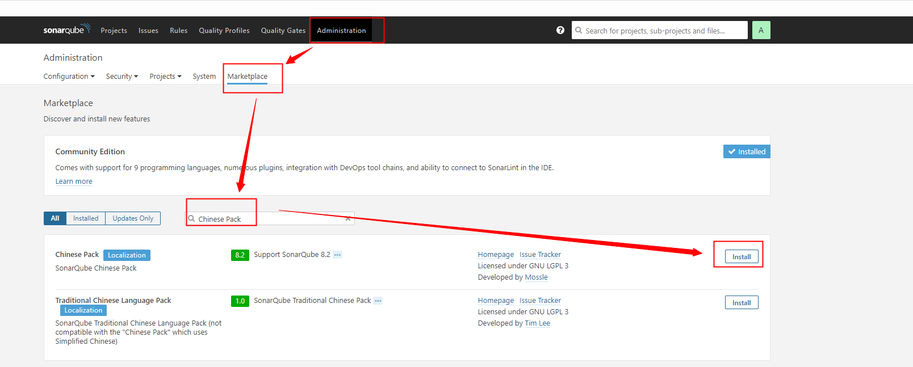

- 按照不成功的话
```
1. 复制插件 【plugins】文件夹下的【sonar-l10n-zh-plugin-1.16.jar】
2. 粘贴到 sonarqube-7.1 > extensions > plugins 文件夹下
3. 重启sonar

```
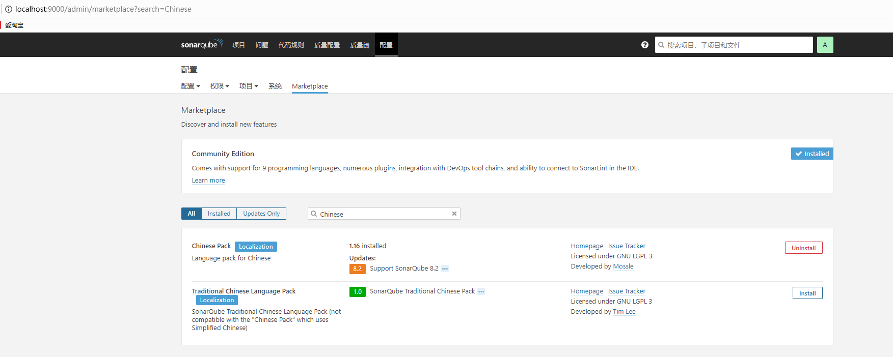


### 2.5 其他插件推荐

插件类别 | 地址
----| ----
javascript 插件列表| [https://binaries.sonarsource.com/Distribution/sonar-javascript-plugin/](https://binaries.sonarsource.com/Distribution/sonar-javascript-plugin/)


### 2.6 数据库配置 (自己做实验可以不配置数据库)

- 2.6.1 插件数据库
```sql
# 创建sonar数据库
# 创建sonar 用户
# 给sonar 赋予权限
# 密码是sonar
CREATE DATABASE sonar CHARACTER SET utf8 COLLATE utf8_general_ci;
CREATE USER 'sonar' IDENTIFIED BY 'sonar';
GRANT ALL ON sonar.* TO 'sonar'@'%' IDENTIFIED BY 'sonar';
GRANT ALL ON sonar.* TO 'sonar'@'localhost' IDENTIFIED BY 'sonar';
FLUSH PRIVILEGES;
```
- 2.6.2 sonar配置数据库

打开sonar/conf目录下的sonar.properties,加入以下配置项:

```properties
##数据库配置
#数据库用户
sonar.jdbc.username=sonar
#数据库密码
sonar.jdbc.password=sonar
#数据库连接url
sonar.jdbc.url=jdbc:mysql://localhost:3306/sonar?useUnicode=true&characterEncoding=utf8&rewriteBatchedStatements=true&useConfigs=maxPerformance&useSSL=false
#下面设定访问网址为 http://localhost:9000
#不设置默认和下面一样
sonar.web.host=0.0.0.0
sonar.web.port=9000
```


## 3.安装 sonar-scanner

### 3.1 前置条件

- jdk环境需要**jdk8**

- 解压到任意目录 【sonar-scanner-cli-3.3.0.1492.zip】（建议，非中文目录）

### 3.2 配置环境变量

变量名| 路径
----| ----
SONAR_SCANNER_HOME | H:\software\sonar-scanner-3.3.0.1492
Path | 添加 %SONAR_SCANNER_HOME%\bin
cmd  | 输入命令 sonar-scanner -v
cmd 结果信息| 下图所示

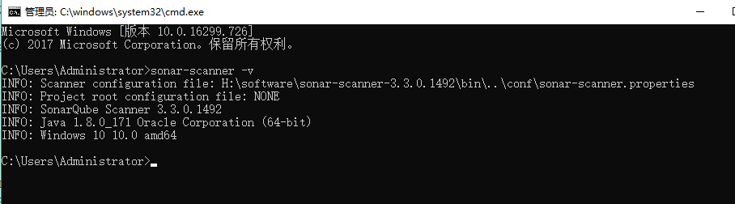


### 3.3 配置sonar地址

- 修改sonar-scanner的配置文件, 将 sonar-host-url 指向目标sonar的地址

> sonar-scanner-3.3.0.1492 > conf >sonar-scanner.properties

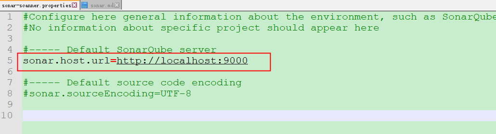


### 3.4 项目扫描

- 3.4.1 新建 sonar-project.properties 文件，将其放入项目根目录， 文件内部内容如下：

```properties
# 项目的key
sonar.projectKey = test

# 项目的名称
sonar.projectName = testProject

# 项目的版本
sonar.projectVersion = 1.0

# 需要分析的源码目录，多个目录用英文的逗号隔开
sonar.sources= src

# 登录web页面的账号
sonar.login=admin

# 登录web页面的密码
sonar.password=admin

# 禁止scm
sonar.scm.disabled=true

# 设置编码格式
sonar.sourceEncoding=UTF-8

# sonar.eslint.reportPaths = report.json

```


示例如下图：

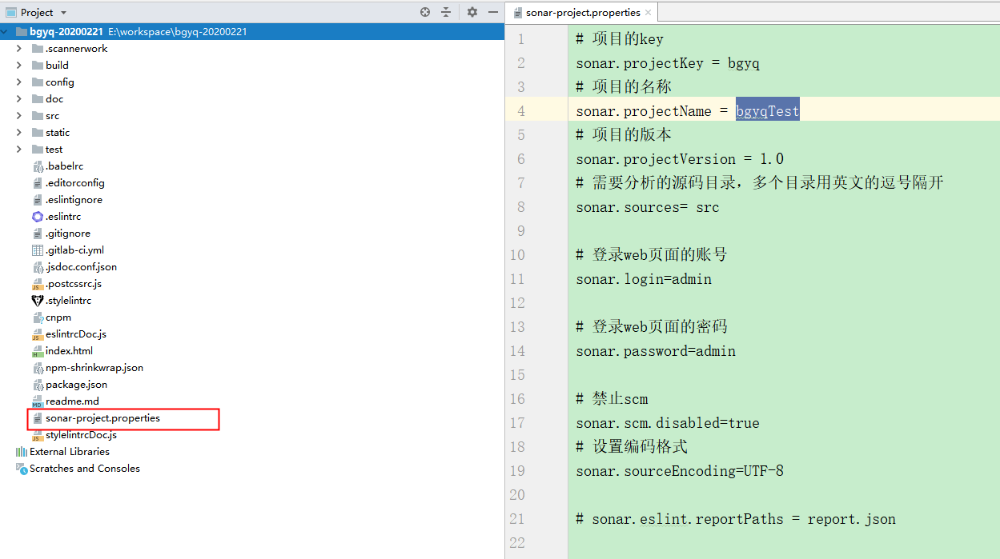


- 3.42 开始扫描

```
 // 在项目目录下，运行 cmd命令
 sonar-scanner
```

- 3.4.3 成功显示图


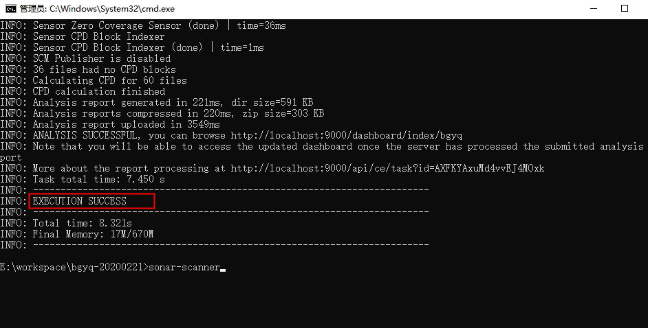

- 3.4.4 sonar 可视化界面

扫描成功后，sonar网站界面的项目中会增加刚刚扫描的项目

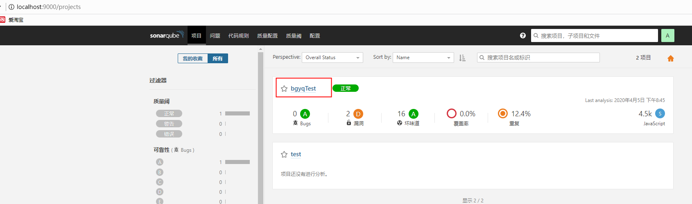


###  3.5 Sonar环境地址

名称 | 地址
:----: | :----
本地 | 默认安装之后为 [http://localhost:9090](http://localhost:9090)
北研 | [http://sonar.thunisoft.com](http://sonar.thunisoft.com)
前端虚拟机 |  [http://172.16.34.74:9000](http://172.16.34.74:9000)


